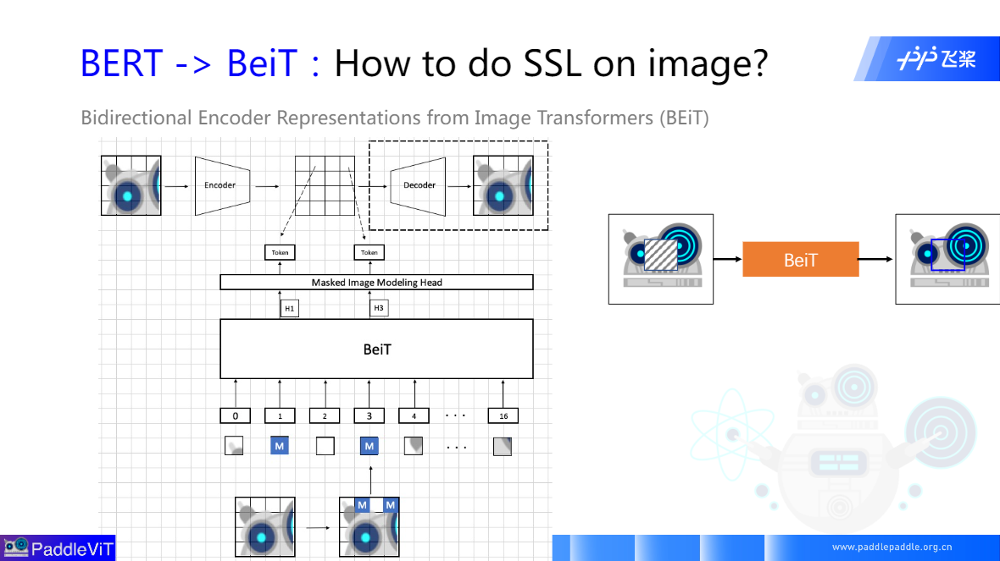

### Transformer + SSL : BERT "家族"
1、Self-Supervised Learning(SSL) 
自监督，学习通用特征表达，用来作为下游任务的预训练或者backbone。自监督学习是无监督学习的子集。 
2、Bidirection Encoder Representations from Transformers(BERT) 
### Bert 到 BeiT

### MAE

自监督学习怎么学习起来？怎么反向传播？ 
Reconstruction Target 

